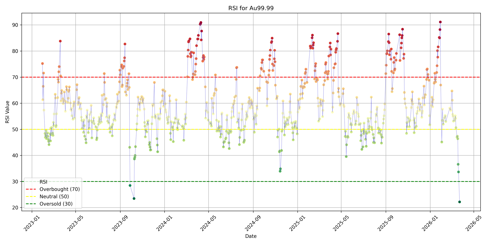

Github 会更新全球主要股指的情况，也会做出一些预测

基本思想是，中美是世界上先进生产力的代表，买入并长期持有是非常赚的

具体操作上，根据 RSI 周期，在绿色期买入，在红色期卖出

本项目用来快速分析股票数据，尤其是国内股票平台不常用的 RSI 数据（相当于导数）

我会每次看的时候都顺手更新一下，不过这样数据就没法实时更新

后续可能会做个网页版，用来自动同步数据，每天自动更新

## Change Log

日志的基本原理是将资本市场视作存钱取钱的机器

在情绪低迷时买入，在情绪上涨时卖出

| 日期 | 上证指数 | 纳指 | 黄金 | 日经 |
| --- | --- | --- | --- | --- |
| 2025-10-18 | 已到3900点附近，适合卖出 | 较为稳定，适合正常定投 | 经过几个月大幅上涨，适合卖出 | 上涨明显，适合卖出|
| 2026-1-31 | 已到4100多点，继续建议卖出 | 2.3-3.4W 附近震荡，适合正常定投 | 短暂冲高到 1200，适合卖出，卖出后可在 1000 左右重新买入 | 5.3W点，适合卖出|
