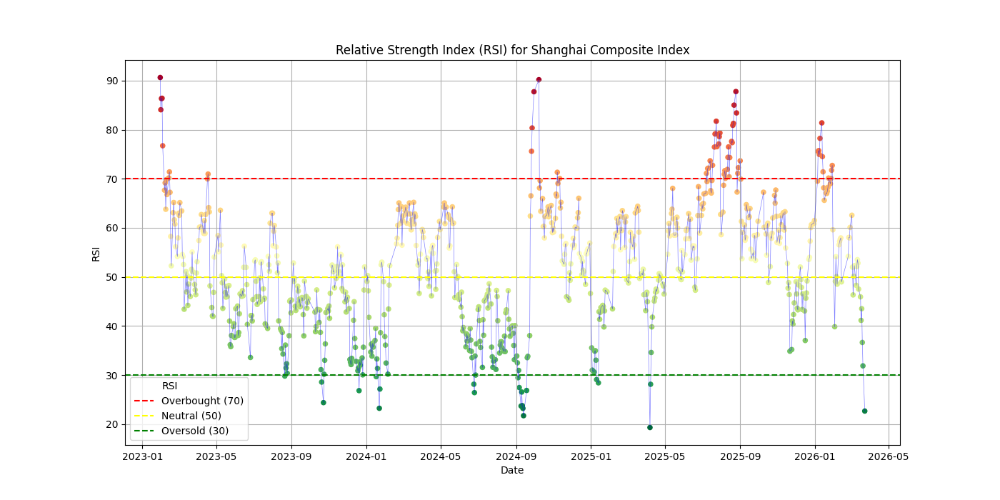
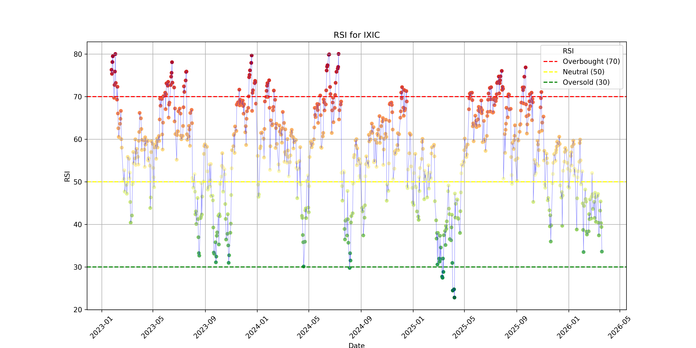
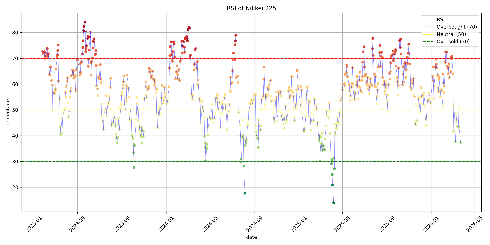

本项目基于 akshare，用于了解全球主要股指的情况

每隔几周到几个月会更新一次，后续可能会做个网页版，用来自动同步数据，每天自动更新

## 项目介绍

本项目属于中线交易，这里简单介绍
- 长线交易：和公司成长，做价值投资、成长投资，进行数年、数十年的长期持有
- 短线交易：利用市场情绪、技术分析获取收益，以天、小时为单位进行炒作题材、提前埋伏、盯盘、止盈止损
- 中线交易：本项目既不是长线交易、也不算短线交易，本项目以几周、几个月为单位，利用经济周期、市场惯性获取收益

策略介绍
- 时间：本项目无法给你提供投机的技巧，你只能在下跌时买入、在上涨时卖出
- 标的：中美是世界上先进生产力的代表，本项目主要关注上证指数、恒生指数、纳斯达克，近期加入日经指数
- 操作：在大盘ETF中画合理均线，在高出时取钱、在低于时存钱
- 数据：根据 RSI（导数）变化，在绿色期买入，在红色期卖出，后续会辅以分位分析

## 数据展示

## Change Log

近期更新：移出了黄金，以降低投机在本项目的占比

| 日期         | 上证指数            | 纳指                              | 日经         |
| ---------- | --------------- | ------------------------------- | ---------- |
| 2025-10-18 | 已到3900点附近，适合卖出  | 较为稳定，适合正常定投                     | 上涨明显，适合卖出  |
| 2026-1-31  | 已到4100多点，继续建议卖出 | 2.3-2.4W 附近震荡，适合正常定投            | 5.3W点，适合卖出 |
| 2026-2-19  | 已到4000多点，继续建议卖出 | 2.2-2.4W 附近震荡，市场似乎进入下跌周期，适合正常定投 | 5.7W点，适合卖出 |
